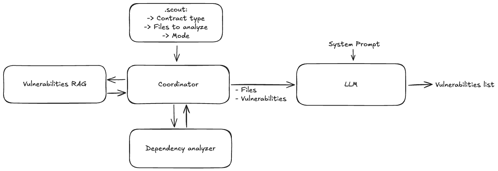

# Scout AI Proof-of-Concept Specification

## 23-Dec-25

# Purpose of this document

Specifies the Scout AI Proof-of-Concept developed for vulnerability detection in the context of Scout security bug detection tool.

# Purpose & Overview

This Proof-of-Concept (PoC) implements a selected approach to add AI for vulnerability detection within the Scout security bug detection tool. Its primary goals are to:

- **Assist Auditors:** Help Rust smart-contract reviewers quickly assemble a structured audit prompt for an LLM.
- **Configurable Modes:** Support deterministic or creative execution modes to control model behavior.
- **Maintain Simplicity:** Stay lightweight so teams can inspect or extend prompts without deep framework knowledge.

# Usage Guide

## Installation

Install once from source using Python 3.12+:

```bash
python3.12 -m venv .venv && source .venv/bin/activate && pip install -r requirements.txt
```

## Running the Tool

The tool is invoked via the `scout-ai-poc` shell script, which forwards commands to the Python entry point (`scout_ai_poc/main.py`).

### 1. Basic & Dry Runs

- **Dry Run (Recommended first step):** Prints the composed prompt (System + Human messages) without calling an LLM.
  ```bash
  ./scout-ai-poc examples --dry-run
  ```
- **Live Run:** Requires `API_KEY` defined in the environment or `.env`.
  ```bash
  export API_KEY=...
  ./scout-ai-poc examples
  ```

### 2. Configuration & Models

- **Targeting:** The CLI looks for a file named `scout.json` inside the target directory.
  - _Note:_ Only files literally named `scout.json` are accepted.
- **Explicit Config:** Point to a specific config file or directory:
  ```bash
  ./scout-ai-poc <target> --config path/to/scout.json
  ```
- **Override Model:** Select a specific provider/model (overriding `scout.json`):
  ```bash
  ./scout-ai-poc <target> --model <name>
  ```
- **Declare Mode:** Choose deterministic (preset parameters) or creative (no overrides) via `scout.json` or CLI.
  - `scout.json` example:
    ```json
    { "mode": "creative" }
    ```
  - CLI override:
    ```bash
    ./scout-ai-poc <target> --llm-mode creative
    ```

### 3. Advanced Context & Dependencies

- **Include Rust Dependencies:** Automatically scans and includes local Rust modules (uses `tree-sitter` for parsing):
  ```bash
  ./scout-ai-poc examples/complex --dry-run --include-deps --dependency-depth 2
  ```
- **Custom Checks:** Stitch in a custom extra prompt (must be a `.txt` file):
  ```bash
  ./scout-ai-poc examples --dry-run --extra-prompt ./prompts/input_validation.txt
  ```

## Understanding the Output

- **Dry Run:** Prints the full prompt structure:
  - `[SYSTEM]`: Base audit instructions with injected variables (contract type, catalog checks).
  - `[HUMAN]`: Rendered request plus all inlined files (prefixed with `// File: <path>`).
  - Missing files appear inline as warnings (e.g., `// File not found: ...`).
- **Live Run:** Prints the LLM response text only.
- **Logging:** Verbosity can be controlled via `SCOUT_LOG_LEVEL` (default: INFO).

# Architecture & Mechanics



## Module Map

- Dependency Analyzer: Expands the file list by resolving local Rust `mod`/`use` paths with BFS and configurable depth.
- Vulnerability RAG: Retrieves the vulnerability catalog by `contract_type` to enrich the prompt.
- LLM: Executes the composed prompt and returns the vulnerability list.

## CLI & Configuration

The CLI wrapper reads inputs from `scout.json`, the command line arguments, and the environment (`API_KEY`). It determines the execution flow based on the presence of the `--dry-run` flag.

## Prompt Assembly

The tool constructs a prompt by merging four key elements:

1.  **Base Template:** Located in `prompts/base_prompt.md`. Enforces a specific audit flow: _Recon → Hunt → Adversarial Review → Exploitability → Mitigation_.
2.  **Catalog Context:** Injects `contract_type` and `known_vulnerabilities` (derived from the catalog).
3.  **User Inputs:** Injects `extra_inputs` (from `--extra-prompt`) or defaults to "None provided."
4.  **File Context:** Inlines source files with path headers.

The pipeline follows a simple structure: `prompt | llm | StrOutputParser()`.

## Vulnerability Catalog

- **Location:** `scout_ai_poc/vulnerability_catalog.py`
- **Purpose:** Provides a stable, editable list of checks per `contract_type` to align findings with specific threat models.
- **Structure:** Entries are tuples of `(description, scope)`. Scope can be generic (`{"ALL"}`) or specific (e.g., `{"lending"}`).

## Dependency Inclusion (Rust-only)

When `--include-deps` is set, the tool performs a local dependency scan:

1.  **Parsing:** Uses `tree_sitter` to scan listed files for `mod foo;` (declarations without bodies) and `use` paths (crate/self/super, scoped, glob).
2.  **Resolution:** Resolves modules to `foo.rs` or `foo/mod.rs`.
3.  **Traversal:** Performs a Breadth-First Search (BFS) with deduplication, limited to the target root and the specified `--dependency-depth` (default: 1).

{ Cristian: Add Directory Structure with descriptions to easily understand it }

## Models & Providers

- **Configuration:** Presets are defined in `scout_ai_poc/llm_config.py`; logic resides in `scout_ai_poc/providers.py`.
- **Supported Families:**
  - **OpenAI:** GPT-5.x and 4.1 variants.
  - **Anthropic:** Claude 4.x and 3.5.
  - **Gemini:** 2.5 and 3 preview.
- **Behavior:** Modes can be declared to either apply deterministic presets (temperature 0, seeded configs) or skip all overrides for creative runs. The `API_KEY` environment variable is used regardless of provider.

# Strengths

- **Configurable Modes:** Choose deterministic presets for tighter control or creative defaults for exploration.
- **Cost Efficiency:** Dry-run mode allows full review of the prompt before spending tokens.
- **Context Aware:** Catalog-driven context keeps findings relevant to the specific contract type.
- **Reduced Blind Spots:** Optional dependency scanning helps catch issues in linked modules.
- **Low Barrier to Entry:** Simple file-based inputs allow easy contribution of new checks; CLI requires no Python expertise to operate.

# Scope & Limitations

- **Scope Constraints:**
  - Dependency scanning is **local-only**; external crates or generated code are not retrieved.
  - No output truncation; large files are inlined as-is.
- **Inherent Limitations:**
- **Probabilistic Nature:** LLM outputs may vary across runs; deterministic mode may reduce variance but does not eliminate it.
  - **Catalog Gaps:** Predefined catalogs may not cover every unique threat model; custom prompts are often necessary.
